## Spring01

## 一、Spring简介

### 1 Spring课程介绍

#### 问题导入

我们为什么要学习Spring框架？

#### 1.1 为什么要学

- Spring技术是JavaEE开发必备技能，企业开发技术选型命中率>==90%==

- 专业角度
  - ==**简化开发**==，降低企业级开发的复杂性
  - **==框架整合==**，高效整合其他技术，提高企业级应用开发与运行效率


#### 1.2 学什么

- 简化开发
  - ==IOC(反转控制)==
  - ==AOP(面向切面编程)==
    - ==事务处理==

- 框架整合
  - MyBatis
  - MyBatis-plus
  - Struts
  - Struts2
  - Hibernate
  - ……

#### 1.3 怎么学

- 学习Spring框架设计思想
- 学习基础操作，思考操作与思想间的联系
- 学习案例，熟练应用操作的同时，体会思想


### 2 初识Spring

#### 问题导入

目前我们使用的是Spring几版本？

#### 2.1 Spring家族

- 官网：https://spring.io
- Spring发展到今天已经形成了一种开发的生态圈，Spring提供了若干个项目，每个项目用于完成特定的功能。

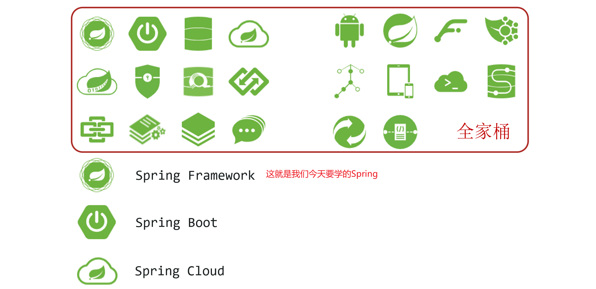

#### 2.2 Spring发展史


### 3 Spring体系结构

#### 问题导入

通过系统架构图，Spring能不能进行数据层开发？Spring能不能进行web层开发？

#### 3.1 Spring Framework系统架构图

- Spring Framework是Spring生态圈中最基础的项目，是其他项目的根基


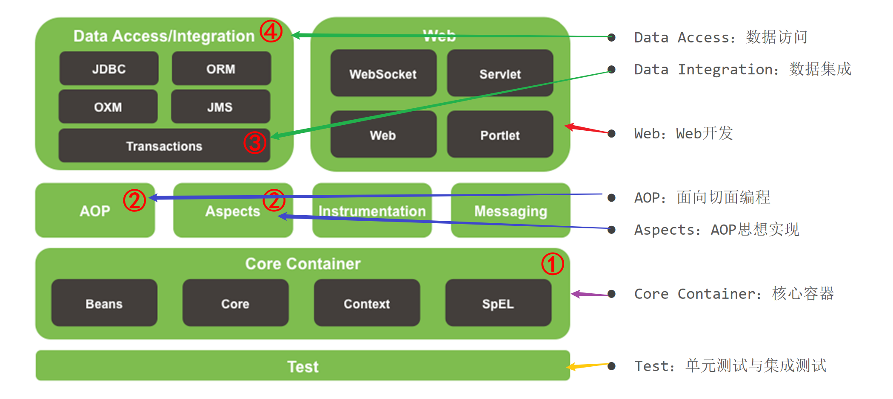

#### 3.2 Spring Framework课程学习路线

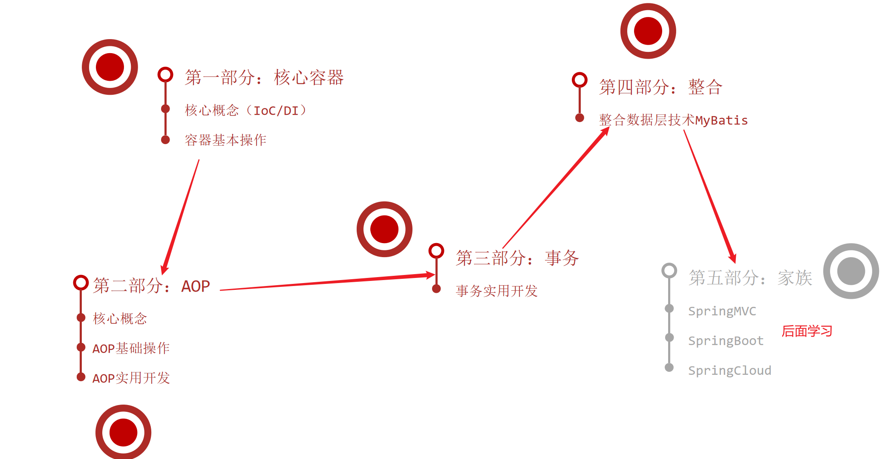


### 4 Spring核心概念

#### 问题导入

问题1：目前我们的代码存在什么问题以及怎么解决这些问题？

问题2：请描述什么是IOC，什么是DI？

#### 4.1 目前我们代码存在的问题


- 代码书写现状
  - 耦合度偏高
- 解决方案
  - 使用对象时，在程序中不要主动使用new产生对象，转换为由外部提供对象

#### 4.2 核心概念

- ==IOC（Inversion of Control）控制反转==

  使用对象时，由主动new产生对象转换为由==外部==提供对象，此过程中对象创建控制权由程序转移到外部，此思想称为控制反转。通俗的讲就是“==将new对象的权利交给Spring，我们从Spring中获取对象使用即可==”

- Spring技术对IoC思想进行了实现

  - Spring提供了一个容器，称为==IOC容器==，用来充当IoC思想中的“外部”
  - IOC容器负责对象的创建、初始化等一系列工作，被创建或被管理的对象在IoC容器中统称为==Bean==

- ==DI（Dependency Injection）依赖注入==

  - 在容器中建立bean与bean之间的依赖关系的整个过程，称为依赖注入。


- 目标：充分解耦
  - 使用IoC容器管理bean（IOC)
  - 在IoC容器内将有依赖关系的bean进行关系绑定（DI）
- 最终效果
  - 使用对象时不仅可以直接从IoC容器中获取，并且获取到的bean已经绑定了所有的依赖关系


## 二、IOC和DI入门案例【重点】

### 1 IOC入门案例【重点】

#### 问题导入

\<bean>标签中id属性和class属性的作用是什么？

#### 1.1 门案例思路分析

1. 管理什么？(Service与Dao)
2. 如何将被管理的对象告知IOC容器？(配置文件)
3. 被管理的对象交给IOC容器，如何获取到IoC容器？(接口)
4. IOC容器得到后，如何从容器中获取bean？(接口方法)
5. 使用Spring导入哪些坐标？(pom.xml)

#### 1.2 实现步骤

```
【第一步】导入Spring坐标
【第二步】定义Spring管理的类（接口）
【第三步】创建Spring配置文件，配置对应类作为Spring管理的bean对象
【第四步】初始化IOC容器（Spring核心容器/Spring容器），通过容器获取bean对象
```

#### 1.3 实现代码

**【第一步】导入Spring坐标**

```xml
<dependencies>
    <!--导入spring的坐标spring-context，对应版本是5.2.10.RELEASE-->
    <dependency>
        <groupId>org.springframework</groupId>
        <artifactId>spring-context</artifactId>
        <version>5.2.10.RELEASE</version>
    </dependency>
</dependencies>
```

**【第二步】定义Spring管理的类（接口）**

- BookDao接口和BookDaoImpl实现类

```java
public interface BookDao {
    public void save();
}

public class BookDaoImpl implements BookDao {
    public void save() {
        System.out.println("book dao save ...");
    }
}
```

- BookService接口和BookServiceImpl实现类

```java
public interface BookService {
    public void save();
}

public class BookServiceImpl implements BookService {
    private BookDao bookDao = new BookDaoImpl();
    public void save() {
        System.out.println("book service save ...");
        bookDao.save();
    }
}
```

**【第三步】创建Spring配置文件，配置对应类作为Spring管理的bean对象**

- 定义applicationContext.xml配置文件并配置BookServiceImpl

```xml
<?xml version="1.0" encoding="UTF-8"?>
<beans xmlns="http://www.springframework.org/schema/beans"
       xmlns:xsi="http://www.w3.org/2001/XMLSchema-instance"
       xsi:schemaLocation="http://www.springframework.org/schema/beans http://www.springframework.org/schema/beans/spring-beans.xsd">

    <!--
		bean标签：表示配置bean
    	id属性：表示给bean起名字
    	class属性：表示给bean定义类型
	-->
    <bean id="bookService" class="com.beisheng.service.impl.BookServiceImpl"></bean>

</beans>
```

**==注意事项：bean定义时id属性在同一个上下文中(IOC容器中)不能重复==**

**【第四步】初始化IOC容器（Spring核心容器/Spring容器），通过容器获取Bean对象**

```java
public class App {
    public static void main(String[] args) {
        //1.创建IoC容器对象，加载spring核心配置文件
        ApplicationContext ctx = new ClassPathXmlApplicationContext("applicationContext.xml");
        //2 从IOC容器中获取Bean对象(BookService对象)
        BookService bookService= (BookService)ctx.getBean("bookService");
        //3 调用Bean对象(BookService对象)的方法
        bookService.save();
    }
}
```

#### 1.4 运行结果


### 2 DI入门案例【重点】

#### 问题导入

\<property>标签中name属性和ref属性的作用是什么？

#### 2.1 DI入门案例思路分析

1. 基于IOC管理bean
2. Service中使用new形式创建的Dao对象是否保留？(否)
3. Service中需要的Dao对象如何进入到Service中？(提供方法)
4. Service与Dao间的关系如何描述？(配置)

#### 2.2 实现步骤

```
【第一步】删除使用new的形式创建对象的代码
【第二步】提供依赖对象对应的setter方法
【第三步】配置service与dao之间的关系
```

#### 2.3 实现代码

**【第一步】删除使用new的形式创建对象的代码**

```java
public class BookServiceImpl implements BookService {
    private BookDao bookDao;  //【第一步】删除使用new的形式创建对象的代码
    public void save() {
        System.out.println("book service save ...");
        bookDao.save();
    }
}
```

**【第二步】提供依赖对象对应的setter方法**

```java
public class BookServiceImpl implements BookService {
    private BookDao bookDao;
    public void save() {
        System.out.println("book service save ...");
        bookDao.save();
    }
    //【第二步】提供依赖对象对应的setter方法
    public void setBookDao(BookDao bookDao) {
        this.bookDao = bookDao;
    }
}
```

**【第三步】配置service与dao之间的关系**

> 在applicationContext.xml中配置

```xml
<?xml version="1.0" encoding="UTF-8"?>
<beans xmlns="http://www.springframework.org/schema/beans"
       xmlns:xsi="http://www.w3.org/2001/XMLSchema-instance"
       xsi:schemaLocation="http://www.springframework.org/schema/beans http://www.springframework.org/schema/beans/spring-beans.xsd">
    <!--
		bean标签：表示配置bean
    	id属性：表示给bean起名字
    	class属性：表示给bean定义类型
	-->
    <bean id="bookDao" class="com.beisheng.dao.impl.BookDaoImpl"/>

    <bean id="bookService" class="com.beisheng.service.impl.BookServiceImpl">
        <!--配置server与dao的关系
			property标签：表示配置当前bean的属性
        	name属性：表示配置哪一个具体的属性
        	ref属性：表示参照哪一个bean
		-->
        <property name="bookDao" ref="bookDao"/>
    </bean>
</beans>
```

#### 2.4 图解演示

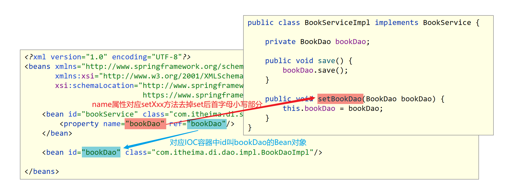


## 三、Bean的基础配置

### 问题导入

问题1：在\<bean>标签上如何配置别名？

问题2：Bean的默认作用范围是什么？如何修改？

### 1 Bean基础配置【重点】

#### 配置说明

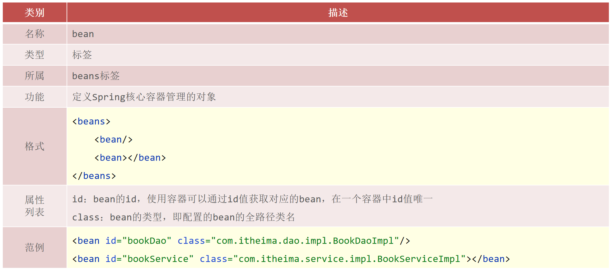


### 2 Bean别名配置

#### 配置说明

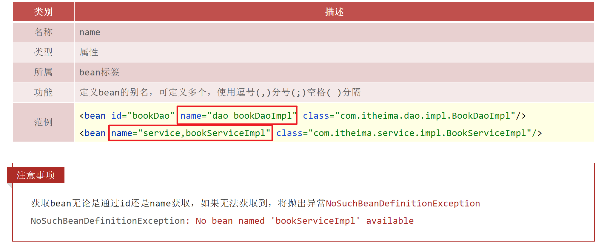

#### 代码演示


#### 打印结果


### 3 Bean作用范围配置【重点】

#### 配置说明


> 扩展：scope的取值不仅仅只有singleton和prototype，还有request、session、application、 websocket ，表示创建出的对象放置在web容器(tomcat)对应的位置。比如：request表示保存到request域中。

#### 代码演示

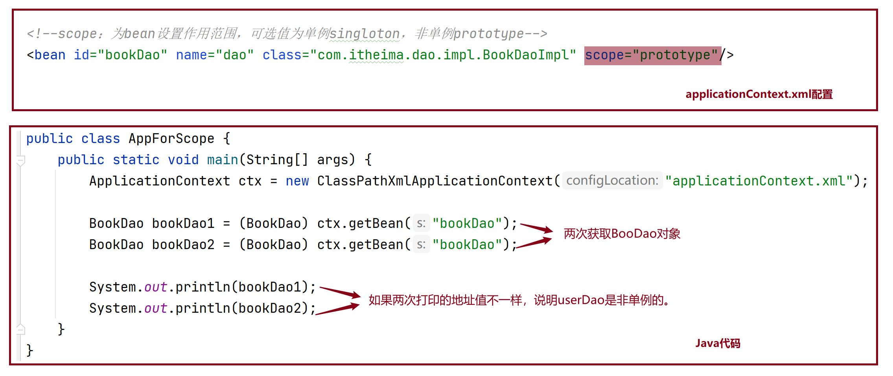

#### 打印结果


> 最后给大家说明一下：在我们的实际开发当中，绝大部分的Bean是单例的，也就是说绝大部分Bean不需要配置scope属性。


## 四、Bean的实例化

### 问题导入

Bean的实例化方式有几种？

### 1 Bean是如何创建的【理解】

bean本质上就是对象，创建bean使用构造方法完成


### 2 实例化Bean的三种方式

#### 2.1 构造方法方式【重点】

- BookDaoImpl实现类

```java
public class BookDaoImpl implements BookDao {
    public BookDaoImpl() {
        System.out.println("book dao constructor is running ....");
    }
    public void save() {
        System.out.println("book dao save ...");
    }
}
```

- applicationContext.xml配置

```xml
<!--方式一：构造方法实例化bean-->
<bean id="bookDao" class="com.beisheng.dao.impl.BookDaoImpl"/>
```

- AppForInstanceBook测试类

```java
public class AppForInstanceBook {
    public static void main(String[] args) {
        ApplicationContext ctx = new ClassPathXmlApplicationContext("applicationContext.xml");

        BookDao bookDao = (BookDao) ctx.getBean("bookDao");

        bookDao.save();
    }
}
```

- 运行结果


==注意：无参构造方法如果不存在，将抛出异常`BeanCreationException`==

#### 2.2 静态工厂方式

- OrderDao接口和OrderDaoImpl实现类

```java
public interface OrderDao {
    public void save();
}
public class OrderDaoImpl implements OrderDao {
    public void save() {
        System.out.println("order dao save ...");
    }
}
```

- OrderDaoFatory工厂类

```java
//静态工厂创建对象
public class OrderDaoFactory {
    public static OrderDao getOrderDao(){
        System.out.println("factory setup....");
        return new OrderDaoImpl();
    }
}
```

- applicationContext.xml配置

```xml
<!--方式二：使用静态工厂实例化bean-->
<bean id="orderDao" class="com.beisheng.factory.OrderDaoFactory" factory-method="getOrderDao"/>
```


- AppForInstanceOrder测试类

```java
public class AppForInstanceOrder {
    public static void main(String[] args) {
        ApplicationContext ctx = new ClassPathXmlApplicationContext("applicationContext.xml");

        OrderDao orderDao = (OrderDao) ctx.getBean("orderDao");

        orderDao.save();
    }
}
```

- 运行结果


#### 2.3 实例工厂方式

- UserDao接口和UserDaoImpl实现类

```java
public interface UserDao {
    public void save();
}
public class UserDaoImpl implements UserDao {
    public void save() {
        System.out.println("user dao save ...");
    }
}
```

- UserDaoFactory工厂类

```java
//实例工厂创建对象
public class UserDaoFactory {
    public UserDao getUserDao(){
        return new UserDaoImpl();
    }
}
```

- applicationContext.xml配置

```xml
<!--方式三：使用实例工厂实例化bean-->
<bean id="userFactory" class="com.beisheng.factory.UserDaoFactory"/>

<bean id="userDao" factory-method="getUserDao" factory-bean="userFactory"/>
```

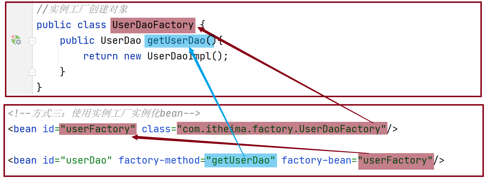

- AppForInstanceUser测试类

```java
public class AppForInstanceUser {
    public static void main(String[] args) {
        //        //创建实例工厂对象
        //        UserDaoFactory userDaoFactory = new UserDaoFactory();
        //        //通过实例工厂对象创建对象
        //        UserDao userDao = userDaoFactory.getUserDao();
        //        userDao.save();
        ApplicationContext ctx = new ClassPathXmlApplicationContext("applicationContext.xml");
        UserDao userDao = (UserDao) ctx.getBean("userDao");
        userDao.save();
    }
}
```

- 运行结果


#### 2.4 实现FactoryBean\<T>方式【扩展,了解】

- 定义UserDaoFactoryBean实现FactoryBean\<UserDao>

> UserDaoFactoryBean中实例化什么类型的对象泛型就是该类型。

```java
//FactoryBean创建对象
public class UserDaoFactoryBean implements FactoryBean<UserDao> {
    //代替原始实例工厂中创建对象的方法
    public UserDao getObject() throws Exception {
        return new UserDaoImpl();
    }

    public Class<?> getObjectType() {
        return UserDao.class;
    }
}
```

- applicationContext.xml配置

```xml
<!--方式四：使用FactoryBean实例化bean-->
<bean id="userDao" class="com.beisheng.factory.UserDaoFactoryBean"/>
```

> 使用之前的AppForInstanceUser测试类去运行看结果就行了。注意配置文件中id="userDao"是否重复。


## 五、Bean的生命周期【了解】

### 问题导入

问题1：多例的Bean能够配置并执行销毁的方法？

问题2：如何做才执行Bean销毁的方法？

### 1 生命周期相关概念介绍

- 生命周期：从创建到消亡的完整过程
- bean生命周期：bean从创建到销毁的整体过程
- bean生命周期控制：在bean创建后到销毁前做一些事情


### 2 代码演示

#### 2.1 Bean生命周期控制

- 提供生命周期控制方法

```java
public class BookDaoImpl implements BookDao {
    public void save() {
        System.out.println("book dao save ...");
    }
    //表示bean初始化对应的操作
    public void init(){
        System.out.println("init...");
    }
    //表示bean销毁前对应的操作
    public void destory(){
        System.out.println("destory...");
    }
}
```

- applicationContext.xml配置

```xml
<!--init-method：设置bean初始化生命周期回调函数,此处填写init方法名-->
<!--destroy-method：设置bean销毁生命周期回调函数，仅适用于单例对象，此处填写destory方法名-->
<bean id="bookDao" class="com.beisheng.dao.impl.BookDaoImpl" init-method="init" destroy-method="destory"/>
```

- 测试类

```java
public class AppForLifeCycle {
    public static void main( String[] args ) {
        //此处需要使用实现类类型，接口类型没有close方法
        ClassPathXmlApplicationContext ctx = new ClassPathXmlApplicationContext("applicationContext.xml");
        BookDao bookDao = (BookDao) ctx.getBean("bookDao");
        bookDao.save();
        //关闭容器，执行销毁的方法
        ctx.close();
    }
}
```

#### 2.2 Bean生命周期控制

- 实现InitializingBean, DisposableBean接口

```java
public class BookServiceImpl implements BookService, InitializingBean, DisposableBean {
    private BookDao bookDao;
    public void setBookDao(BookDao bookDao) {
        System.out.println("set .....");
        this.bookDao = bookDao;
    }
    public void save() {
        System.out.println("book service save ...");
        bookDao.save();
    }
    public void destroy() throws Exception {
        System.out.println("service destroy");
    }
    public void afterPropertiesSet() throws Exception {
        System.out.println("service init");
    }
}
```


### 3 Bean销毁时机

- 容器关闭前触发bean的销毁
- 关闭容器方式：
  - 手工关闭容器
    `ConfigurableApplicationContext`接口`close()`操作
  - 注册关闭钩子，在虚拟机退出前先关闭容器再退出虚拟机
    `ConfigurableApplicationContext`接口`registerShutdownHook()`操作

```java
public class AppForLifeCycle {
    public static void main( String[] args ) {
        //此处需要使用实现类类型，接口类型没有close方法
        ClassPathXmlApplicationContext ctx = new ClassPathXmlApplicationContext("applicationContext.xml");

        BookDao bookDao = (BookDao) ctx.getBean("bookDao");
        bookDao.save();
        //注册关闭钩子函数，在虚拟机退出之前回调此函数，关闭容器
        ctx.registerShutdownHook();
        //关闭容器
        //ctx.close();
    }
}
```


## 六、依赖注入(DI配置)

### 1 依赖注入方式【重点】

#### 问题导入

依赖注入有几种方式？

#### 1.1 依赖注入的两种方式

- setter注入
  简单类型
  ==**引用类型(很常用)**==
- 构造器注入
  简单类型
  引用类型

#### 1.2 setter方式注入

##### 问题导入

setter方式注入使用什么子标签？

##### 引用类型

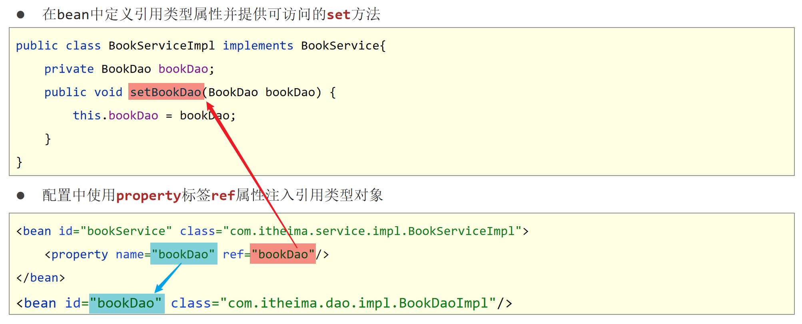

##### 简单类型

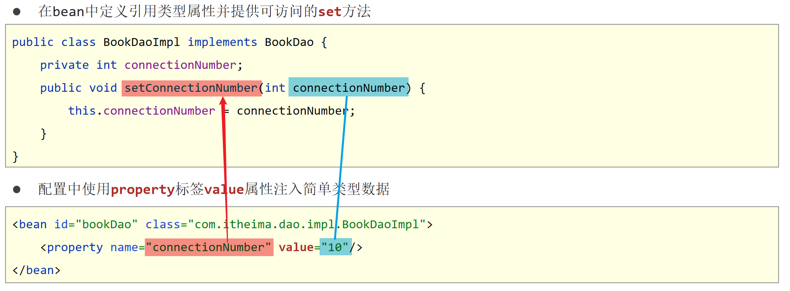

#### 1.3 构造方式注入

##### 问题导入

构造方式注入使用什么子标签？

##### 引用类型

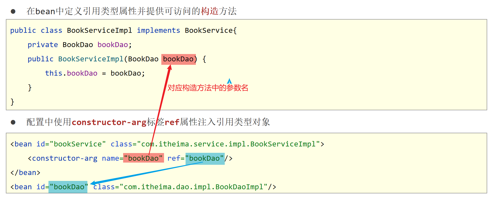

##### 简单类型

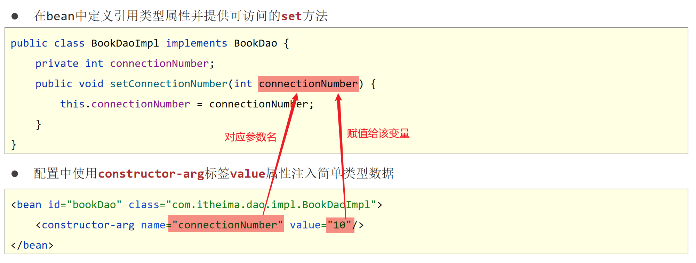

##### 参数适配【了解】


#### 1.4 依赖注入方式选择

1. 强制依赖使用构造器进行，使用setter注入有概率不进行注入导致null对象出现
2. 可选依赖使用setter注入进行，灵活性强
3. Spring框架倡导使用构造器，第三方框架内部大多数采用构造器注入的形式进行数据初始化，相对严谨
4. 如果有必要可以两者同时使用，使用构造器注入完成强制依赖的注入，使用setter注入完成可选依赖的注入
5. 实际开发过程中还要根据实际情况分析，如果受控对象没有提供setter方法就必须使用构造器注入
6. **==自己开发的模块推荐使用setter注入==**


### 2 依赖自动装配【理解】

#### 问题导入

如何配置按照类型自动装配？

#### 2.1 自动装配概念

- IoC容器根据bean所依赖的资源在容器中自动查找并注入到bean中的过程称为自动装配
- 自动装配方式
  ==按类型（常用）==
  按名称
  按构造方法
  不启用自动装配

#### 2.2 自动装配类型

##### 依赖自动装配

> 配置中使用bean标签autowire属性设置自动装配的类型

```xml
<bean id="bookDao" class="com.beisheng.dao.impl.BookDaoImpl"/>
<bean id="bookService" class="com.beisheng.service.impl.BookServiceImpl" autowire="byType"/>
```

##### 依赖自动装配特征

1. 自动装配用于引用类型依赖注入，不能对简单类型进行操作
2. 使用按类型装配时（byType）必须保障容器中相同类型的bean唯一，推荐使用
3. 使用按名称装配时（byName）必须保障容器中具有指定名称的bean，因变量名与配置耦合，不推荐使用
4. 自动装配优先级低于setter注入与构造器注入，同时出现时自动装配配置失效


### 3 集合注入

#### 3.1 注入数组类型数据

```xml
<property name="array">
    <array>
        <value>100</value>
        <value>200</value>
        <value>300</value>
    </array>
</property>
```

#### 3.2 注入List类型数据

```xml
<property name="list">
    <list>
        <value>beisheng</value>
        <value>beisheng</value>
        <value>boxuegu</value>
        <value>beisheng</value>
    </list>
</property>
```

#### 3.3 注入Set类型数据

```xml
<property name="set">
    <set>
        <value>beisheng</value>
        <value>beisheng</value>
        <value>boxuegu</value>
        <value>boxuegu</value>
    </set>
</property>
```

#### 3.4 注入Map类型数据

```xml
<property name="map">
    <map>
        <entry key="country" value="china"/>
        <entry key="province" value="henan"/>
        <entry key="city" value="kaifeng"/>
    </map>
</property>
```

#### 3.5 注入Properties类型数据

```xml
<property name="properties">
    <props>
        <prop key="country">china</prop>
        <prop key="province">henan</prop>
        <prop key="city">kaifeng</prop>
    </props>
</property>
```

> 说明：property标签表示setter方式注入，构造方式注入constructor-arg标签内部也可以写\<array>、\<list>、\<set>、\<map>、\<props>标签
