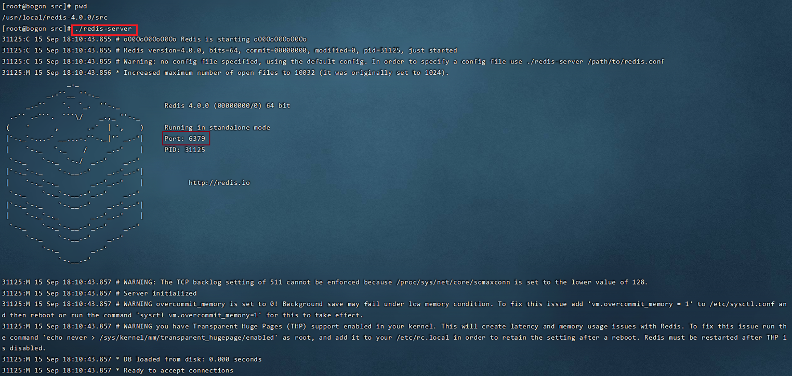
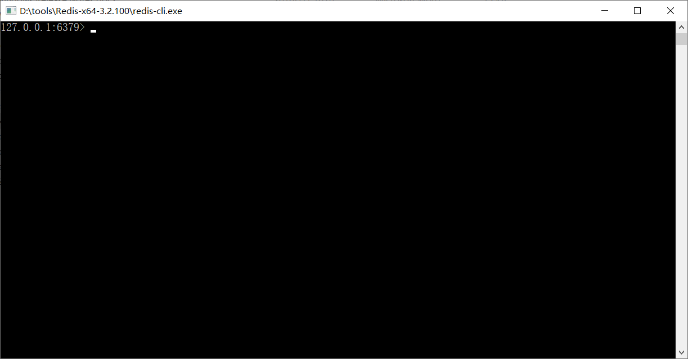

# Redis基础

- Redis入门
- Redis数据类型
- Redis常用命令
- 在Java中操作Redis

## 1. 前言

### 1.1 什么是Redis

Redis是一个基于**内存**的key-value结构数据库。Redis 是互联网技术领域使用最为广泛的存储中间件，它是「**Re**mote **Di**ctionary **S**ervice」的首字母缩写，也就是「远程字典服务」。

- [ ] 基于内存存储，读写性能高

- [ ] 适合存储热点数据（热点商品、资讯、新闻）

- [ ] 企业应用广泛

### 1.2 使用Redis能做什么

- 数据缓存
- 消息队列
- 注册中心
- 发布订阅

## 2. Redis入门

### 2.1 Redis简介

Redis is an open source (BSD licensed), in-memory data structure store, used as a database, cache, and message broker. 翻译为：Redis是一个开源的内存中的数据结构存储系统，它可以用作：数据库、缓存和消息中间件。

官网：[https://redis.io](https://redis.io/)

Redis是用C语言开发的一个开源的高性能键值对(key-value)数据库，官方提供的数据是可以达到100000+的QPS（每秒内查询次数）。它存储的value类型比较丰富，也被称为结构化的NoSql数据库。

NoSql（Not Only SQL），不仅仅是SQL，泛指**非关系型数据库**。NoSql数据库并不是要取代关系型数据库，而是关系型数据库的补充。

关系型数据库(RDBMS)：

- Mysql
- Oracle
- DB2
- SQLServer

非关系型数据库(NoSql)：

- Redis
- Mongo db
- MemCached

### 2.2 Redis下载与安装

#### 2.2.1 Redis下载

Redis安装包分为windows版和Linux版：

- Windows版下载地址：https://github.com/microsoftarchive/redis/releases
- Linux版下载地址： https://download.redis.io/releases/

下载后得到下面安装包：

#### 2.2.2 Redis安装

**1）在Linux中安装Redis**

在Linux系统安装Redis步骤：

1. 将Redis安装包上传到Linux
2. 解压安装包，命令：==tar -zxvf redis-4.0.0.tar.gz -C /usr/local==
3. 安装Redis的依赖环境gcc，命令：==yum install gcc-c++==
4. 进入/usr/local/redis-4.0.0，进行编译，命令：==make==
5. 进入redis的src目录进行安装，命令：==make install==

安装后重点文件说明：

> /usr/local/redis-4.0.0/src/redis-server：Redis服务启动脚本
>
> /usr/local/redis-4.0.0/src/redis-cli：Redis客户端脚本
>
> /usr/local/redis-4.0.0/redis.conf：Redis配置文件

**2）在Windows中安装Redis**

Redis的Windows版属于绿色软件，直接解压即可使用，解压后目录结构如下：

### 2.3 Redis服务启动与停止

**1）Linux系统中启动和停止Redis**

执行Redis服务启动脚本文件==redis-server==：

通过启动日志可以看到，Redis默认端口号为==6379==。

==Ctrl + C==停止Redis服务

通过==redis-cli==可以连接到本地的Redis服务，默认情况下不需要认证即可连接成功。

退出客户端可以输入==exit==或者==quit==命令。

**2）Windows系统中启动和停止Redis**

Windows系统中启动Redis，直接双击redis-server.exe即可启动Redis服务，redis服务默认端口号为6379

==Ctrl + C==停止Redis服务

双击==redis-cli.exe==即可启动Redis客户端，默认连接的是本地的Redis服务，而且不需要认证即可连接成功。

退出客户端可以输入==exit==或者==quit==命令。

### 2.4 Redis配置文件

前面我们已经启动了Redis服务，默认情况下Redis启动后是在前台运行，而且客户端不需要密码就可以连接到Redis服务。如果我们希望Redis服务启动后是在后台运行，同时希望客户端认证通过后才能连接到Redis服务，应该如果做呢？

此时就需要修改Redis的配置文件：

- Linux系统中Redis配置文件：REDIS_HOME/redis.conf
- Windows系统中Redis配置文件：REDIS_HOME/redis.windows.conf

**通过修改Redis配置文件可以进行如下配置：**

**1）**设置Redis服务后台运行

​	将配置文件中的==daemonize==配置项改为yes，默认值为no。

​	注意：Windows版的Redis不支持后台运行。

**2）**设置Redis服务密码

​	将配置文件中的 ==# requirepass foobared== 配置项取消注释，默认为注释状态。foobared为密码，可以根据情况自己指定。

**3）**设置允许客户端远程连接Redis服务

​	Redis服务默认只能客户端本地连接，不允许客户端远程连接。将配置文件中的 ==bind 127.0.0.1== 配置项注释掉。

**解释说明：**

> Redis配置文件中 ==#== 表示注释
>
> Redis配置文件中的配置项前面不能有空格，需要顶格写
>
> daemonize：用来指定redis是否要用守护线程的方式启动，设置成yes时，代表开启守护进程模式。在该模式下，redis会在后台运行
>
> requirepass：设置Redis的连接密码
>
> bind：如果指定了bind，则说明只允许来自指定网卡的Redis请求。如果没有指定，就说明可以接受来自任意一个网卡的Redis请求。

**注意**：修改配置文件后需要重启Redis服务配置才能生效，并且启动Redis服务时需要显示的指定配置文件：

1）Linux中启动Redis服务

~~~
# 进入Redis安装目录
cd /usr/local/redis-4.0.0
# 启动Redis服务，指定使用的配置文件
./src/redis-server ./redis.conf
~~~

2）Windows中启动Redis服务

由于Redis配置文件中开启了认证校验，即客户端连接时需要提供密码，此时客户端连接方式变为：

**解释说明：**

> -h：指定连接的Redis服务的ip地址
>
> -p：指定连接的Redis服务的端口号
>
> -a：指定连接的Redis服务的密码

## 3. Redis数据类型

### 3.1 介绍

Redis存储的是key-value结构的数据，其中key是字符串类型，value有5种常用的数据类型：

- 字符串 string
- 哈希 hash
- 列表 list
- 集合 set
- 有序集合 sorted set / zset

### 3.2 Redis 5种常用数据类型

**解释说明：**

> 字符串(string)：普通字符串，常用
>
> 哈希(hash)：适合存储对象
>
> 列表(list)：按照插入顺序排序，可以有重复元素
>
> 集合(set)：无序集合，没有重复元素
>
> 有序集合(sorted set / zset)：集合中每个元素关联一个分数（score），根据分数升序排序，没有重复元素

## 4. Redis常用命令

### 4.1 字符串string操作命令

Redis 中字符串类型常用命令：

- **SET** key value 					         设置指定key的值
- **GET** key                                        获取指定key的值
- **SETEX** key seconds value         设置指定key的值，并将 key 的过期时间设为 seconds 秒
- **SETNX** key value 只有在 key    不存在时设置 key 的值

更多命令可以参考Redis中文网：https://www.redis.net.cn

### 4.2 哈希hash操作命令

Redis hash 是一个string类型的 field 和 value 的映射表，hash特别适合用于存储对象，常用命令：

- **HSET** key field value             将哈希表 key 中的字段 field 的值设为 value
- **HGET** key field                       获取存储在哈希表中指定字段的值
- **HDEL** key field                       删除存储在哈希表中的指定字段
- **HKEYS** key                              获取哈希表中所有字段
- **HVALS** key                              获取哈希表中所有值
- **HGETALL** key                         获取在哈希表中指定 key 的所有字段和值

### 4.3 列表list操作命令

Redis 列表是简单的字符串列表，按照插入顺序排序，常用命令：

- **LPUSH** key value1 [value2]         将一个或多个值插入到列表头部
- **LRANGE** key start stop                获取列表指定范围内的元素
- **RPOP** key                                       移除并获取列表最后一个元素
- **LLEN** key                                        获取列表长度
- **BRPOP** key1 [key2 ] timeout       移出并获取列表的最后一个元素， 如果列表没有元素会阻塞列表直到等待超时或发现可弹出元素为止

### 4.4 集合set操作命令

Redis set 是string类型的无序集合。集合成员是唯一的，这就意味着集合中不能出现重复的数据，常用命令：

- **SADD** key member1 [member2]            向集合添加一个或多个成员
- **SMEMBERS** key                                         返回集合中的所有成员
- **SCARD** key                                                  获取集合的成员数
- **SINTER** key1 [key2]                                   返回给定所有集合的交集
- **SUNION** key1 [key2]                                 返回所有给定集合的并集
- **SDIFF** key1 [key2]                                      返回给定所有集合的差集
- **SREM** key member1 [member2]            移除集合中一个或多个成员

### 4.5 有序集合sorted set操作命令

Redis sorted set 有序集合是 string 类型元素的集合，且不允许重复的成员。每个元素都会关联一个double类型的分数(score) 。redis正是通过分数来为集合中的成员进行从小到大排序。有序集合的成员是唯一的，但分数却可以重复。

常用命令：

- **ZADD** key score1 member1 [score2 member2]     向有序集合添加一个或多个成员，或者更新已存在成员的 分数
- **ZRANGE** key start stop [WITHSCORES]                     通过索引区间返回有序集合中指定区间内的成员
- **ZINCRBY** key increment member                              有序集合中对指定成员的分数加上增量 increment
- **ZREM** key member [member ...]                                移除有序集合中的一个或多个成员

### 4.6 通用命令

Redis中的通用命令，主要是针对key进行操作的相关命令：

- **KEYS** pattern  查找所有符合给定模式( pattern)的 key
- **EXISTS** key  检查给定 key 是否存在
- **TYPE** key  返回 key 所储存的值的类型
- **TTL** key  返回给定 key 的剩余生存时间(TTL, time to live)，以秒为单位
- **DEL** key  该命令用于在 key 存在是删除 key

## 5. 在Java中操作Redis

### 5.1 介绍

前面我们讲解了Redis的常用命令，这些命令是我们操作Redis的基础，那么我们在java程序中应该如何操作Redis呢？这就需要使用Redis的Java客户端，就如同我们使用JDBC操作MySQL数据库一样。

Redis 的 Java 客户端很多，官方推荐的有三种：

- Jedis
- Lettuce
- Redisson

Spring 对 Redis 客户端进行了整合，提供了 Spring Data Redis，在Spring Boot项目中还提供了对应的Starter，即 spring-boot-starter-data-redis。

### 5.2 Jedis

Jedis 是 Redis 的 Java 版本的客户端实现。

maven坐标：

~~~xml
<dependency>
	<groupId>redis.clients</groupId>
	<artifactId>jedis</artifactId>
	<version>2.8.0</version>
</dependency>
~~~

使用 Jedis 操作 Redis 的步骤：

1. 获取连接
2. 执行操作
3. 关闭连接

示例代码：

~~~java
package com.itheima.test;

import org.junit.Test;
import redis.clients.jedis.Jedis;
import java.util.Set;

/**
 * 使用Jedis操作Redis
 */
public class JedisTest {

    @Test
    public void testRedis(){
        //1 获取连接
        Jedis jedis = new Jedis("localhost",6379);

        //2 执行具体的操作
        jedis.set("username","xiaoming");

        String value = jedis.get("username");
        System.out.println(value);

        //jedis.del("username");

        jedis.hset("myhash","addr","bj");
        String hValue = jedis.hget("myhash", "addr");
        System.out.println(hValue);

        Set<String> keys = jedis.keys("*");
        for (String key : keys) {
            System.out.println(key);
        }

        //3 关闭连接
        jedis.close();
    }
}
~~~

### 5.3 Spring Data Redis

#### 5.3.1 介绍

Spring Data Redis 是 Spring 的一部分，提供了在 Spring 应用中通过简单的配置就可以访问 Redis 服务，对 Redis 底层开发包进行了高度封装。在 Spring 项目中，可以使用Spring Data Redis来简化 Redis 操作。

网址：https://spring.io/projects/spring-data-redis

maven坐标：

~~~xml
<dependency>
	<groupId>org.springframework.data</groupId>
	<artifactId>spring-data-redis</artifactId>
	<version>2.4.8</version>
</dependency>
~~~

Spring Boot提供了对应的Starter，maven坐标：

~~~xml
<dependency>
	<groupId>org.springframework.boot</groupId>
	<artifactId>spring-boot-starter-data-redis</artifactId>
</dependency>
~~~

Spring Data Redis中提供了一个高度封装的类：**RedisTemplate**，针对 Jedis 客户端中大量api进行了归类封装,将同一类型操作封装为operation接口，具体分类如下：

- ValueOperations：简单K-V操作
- SetOperations：set类型数据操作
- ZSetOperations：zset类型数据操作
- HashOperations：针对hash类型的数据操作
- ListOperations：针对list类型的数据操作

#### 5.3.2 使用方式

##### 5.3.2.1 环境搭建

第一步：创建maven项目springdataredis_demo，配置pom.xml文件

~~~xml
<?xml version="1.0" encoding="UTF-8"?>
<project xmlns="http://maven.apache.org/POM/4.0.0"
         xmlns:xsi="http://www.w3.org/2001/XMLSchema-instance"
         xsi:schemaLocation="http://maven.apache.org/POM/4.0.0 http://maven.apache.org/xsd/maven-4.0.0.xsd">
    <modelVersion>4.0.0</modelVersion>
    <parent>
        <groupId>org.springframework.boot</groupId>
        <artifactId>spring-boot-starter-parent</artifactId>
        <version>2.4.5</version>
        <relativePath/>
    </parent>
    <groupId>com.itheima</groupId>
    <artifactId>springdataredis_demo</artifactId>
    <version>1.0-SNAPSHOT</version>
    <properties>
        <java.version>1.8</java.version>
    </properties>
    <dependencies>
        <dependency>
            <groupId>org.springframework.boot</groupId>
            <artifactId>spring-boot-starter-test</artifactId>
            <scope>test</scope>
        </dependency>
        <dependency>
            <groupId>junit</groupId>
            <artifactId>junit</artifactId>
        </dependency>
        <dependency>
            <groupId>org.springframework.boot</groupId>
            <artifactId>spring-boot-starter-data-redis</artifactId>
        </dependency>
    </dependencies>
    <build>
        <plugins>
            <plugin>
                <groupId>org.springframework.boot</groupId>
                <artifactId>spring-boot-maven-plugin</artifactId>
                <version>2.4.5</version>
            </plugin>
        </plugins>
    </build>
</project>
~~~

第二步：编写启动类

~~~java
package com.itheima;

import org.springframework.boot.SpringApplication;
import org.springframework.boot.autoconfigure.SpringBootApplication;

@SpringBootApplication
public class App {

    public static void main(String[] args) {
        SpringApplication.run(App.class,args);
    }

}
~~~

第三步：配置application.yml

~~~yaml
spring:
  application:
    name: springdataredis_demo
  #Redis相关配置
  redis:
    host: localhost
    port: 6379
    #password: 123456
    database: 0 #操作的是0号数据库
    jedis:
      #Redis连接池配置
      pool:
        max-active: 8 #最大连接数
        max-wait: 1ms #连接池最大阻塞等待时间
        max-idle: 4 #连接池中的最大空闲连接
        min-idle: 0 #连接池中的最小空闲连接
~~~

解释说明：

> spring.redis.database：指定使用Redis的哪个数据库，Redis服务启动后默认有16个数据库，编号分别是从0到15。
>
> 可以通过修改Redis配置文件来指定数据库的数量。

第四步：提供配置类

~~~java
package com.itheima.config;

import org.springframework.cache.annotation.CachingConfigurerSupport;
import org.springframework.context.annotation.Bean;
import org.springframework.context.annotation.Configuration;
import org.springframework.data.redis.connection.RedisConnectionFactory;
import org.springframework.data.redis.core.RedisTemplate;
import org.springframework.data.redis.serializer.StringRedisSerializer;

/**
 * Redis配置类
 */
@Configuration
public class RedisConfig extends CachingConfigurerSupport {

    @Bean
    public RedisTemplate<Object, Object> redisTemplate(RedisConnectionFactory connectionFactory) {

        RedisTemplate<Object, Object> redisTemplate = new RedisTemplate<>();

        //默认的Key序列化器为：JdkSerializationRedisSerializer
        redisTemplate.setKeySerializer(new StringRedisSerializer());
        redisTemplate.setHashKeySerializer(new StringRedisSerializer());

        redisTemplate.setConnectionFactory(connectionFactory);

        return redisTemplate;
    }

}
~~~

解释说明：

> 当前配置类不是必须的，因为 Spring Boot 框架会自动装配 RedisTemplate 对象，但是默认的key序列化器为JdkSerializationRedisSerializer，导致我们存到Redis中后的数据和原始数据有差别

第五步：提供测试类

~~~java
package com.itheima.test;

import org.junit.runner.RunWith;
import org.springframework.beans.factory.annotation.Autowired;
import org.springframework.boot.test.context.SpringBootTest;
import org.springframework.test.context.junit4.SpringRunner;

@SpringBootTest
@RunWith(SpringRunner.class)
public class SpringDataRedisTest {

    @Autowired
    private RedisTemplate redisTemplate;

}
~~~

##### 5.3.2.2 操作字符串类型数据

~~~java
/**
 * 操作String类型数据
*/
@Test
public void testString(){
    //存值
    redisTemplate.opsForValue().set("city123","beijing");

    //取值
    String value = (String) redisTemplate.opsForValue().get("city123");
    System.out.println(value);

    //存值，同时设置过期时间
    redisTemplate.opsForValue().set("key1","value1",10l, TimeUnit.SECONDS);

    //存值，如果存在则不执行任何操作
    Boolean aBoolean = redisTemplate.opsForValue().setIfAbsent("city1234", "nanjing");
    System.out.println(aBoolean);
}
~~~

##### 5.3.2.3 操作哈希类型数据

~~~java
/**
 * 操作Hash类型数据
*/
@Test
public void testHash(){
    HashOperations hashOperations = redisTemplate.opsForHash();

    //存值
    hashOperations.put("002","name","xiaoming");
    hashOperations.put("002","age","20");
    hashOperations.put("002","address","bj");

    //取值
    String age = (String) hashOperations.get("002", "age");
    System.out.println(age);

    //获得hash结构中的所有字段
    Set keys = hashOperations.keys("002");
    for (Object key : keys) {
        System.out.println(key);
    }

    //获得hash结构中的所有值
    List values = hashOperations.values("002");
    for (Object value : values) {
        System.out.println(value);
    }
}
~~~

##### 5.3.2.4 操作列表类型数据

~~~java
/**
 * 操作List类型的数据
*/
@Test
public void testList(){
    ListOperations listOperations = redisTemplate.opsForList();

    //存值
    listOperations.leftPush("mylist","a");
    listOperations.leftPushAll("mylist","b","c","d");

    //取值
    List<String> mylist = listOperations.range("mylist", 0, -1);
    for (String value : mylist) {
        System.out.println(value);
    }

    //获得列表长度 llen
    Long size = listOperations.size("mylist");
    int lSize = size.intValue();
    for (int i = 0; i < lSize; i++) {
        //出队列
        String element = (String) listOperations.rightPop("mylist");
        System.out.println(element);
    }
}
~~~

##### 5.3.2.5 操作集合类型数据

~~~java
/**
 * 操作Set类型的数据
*/
@Test
public void testSet(){
    SetOperations setOperations = redisTemplate.opsForSet();

    //存值
    setOperations.add("myset","a","b","c","a");

    //取值
    Set<String> myset = setOperations.members("myset");
    for (String o : myset) {
        System.out.println(o);
    }

    //删除成员
    setOperations.remove("myset","a","b");

    //取值
    myset = setOperations.members("myset");
    for (String o : myset) {
        System.out.println(o);
    }

}
~~~

##### 5.3.2.6 操作有序集合类型数据

~~~java
/**
 * 操作ZSet类型的数据
*/
@Test
public void testZset(){
    ZSetOperations zSetOperations = redisTemplate.opsForZSet();

    //存值
    zSetOperations.add("myZset","a",10.0);
    zSetOperations.add("myZset","b",11.0);
    zSetOperations.add("myZset","c",12.0);
    zSetOperations.add("myZset","a",13.0);

    //取值
    Set<String> myZset = zSetOperations.range("myZset", 0, -1);
    for (String s : myZset) {
        System.out.println(s);
    }

    //修改分数
    zSetOperations.incrementScore("myZset","b",20.0);

    //取值
    myZset = zSetOperations.range("myZset", 0, -1);
    for (String s : myZset) {
        System.out.println(s);
    }

    //删除成员
    zSetOperations.remove("myZset","a","b");

    //取值
    myZset = zSetOperations.range("myZset", 0, -1);
    for (String s : myZset) {
        System.out.println(s);
    }
}
~~~

##### 5.3.2.7 通用操作

~~~java
/**
 * 通用操作，针对不同的数据类型都可以操作
*/
@Test
public void testCommon(){
    //获取Redis中所有的key
    Set<String> keys = redisTemplate.keys("*");
    for (String key : keys) {
        System.out.println(key);
    }

    //判断某个key是否存在
    Boolean beisheng = redisTemplate.hasKey("beisheng");
    System.out.println(beisheng);

    //删除指定key
    redisTemplate.delete("myZset");

    //获取指定key对应的value的数据类型
    DataType dataType = redisTemplate.type("myset");
    System.out.println(dataType.name());

}
~~~

